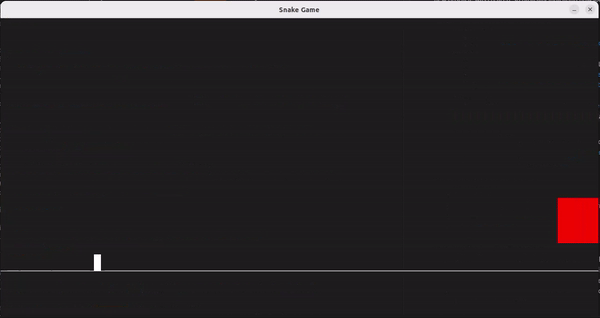

# CPPND: Capstone - Jump Game

This repository contains the code for the Capstone project in the [Udacity C++ Nanodegree Program](https://www.udacity.com/course/c-plus-plus-nanodegree--nd213), submitted by Marius Weber. The code for this repo was based on the [SnakeGame repo](https://github.com/udacity/CppND-Capstone-Snake-Game) provided by udacity. 

The approach that I took was to use the SnakeGame repository as a starting point and then reducing it to a bare minimum, to create a new game out of it afterwards. It is a kind of jump and run game that will run forever, unless the player dies. There are red obstacles moving across the window that the player needs to avoid. Target of the game is to achieve the alltime highscore, that gets saved. The score is increased whenever a new obstacle was created, so basically indicating how long the player survived.

## Dependencies for Running Locally
* cmake >= 3.7
  * All OSes: [click here for installation instructions](https://cmake.org/install/)
* make >= 4.1 (Linux, Mac), 3.81 (Windows)
  * Linux: make is installed by default on most Linux distros
  * Mac: [install Xcode command line tools to get make](https://developer.apple.com/xcode/features/)
  * Windows: [Click here for installation instructions](http://gnuwin32.sourceforge.net/packages/make.htm)
* SDL2 >= 2.0
  * All installation instructions can be found [here](https://wiki.libsdl.org/Installation)
  >Note that for Linux, an `apt` or `apt-get` installation is preferred to building from source. (e.g. sudo apt install libsdl2-dev)
* gcc/g++ >= 5.4
  * Linux: gcc / g++ is installed by default on most Linux distros
  * Mac: same deal as make - [install Xcode command line tools](https://developer.apple.com/xcode/features/)
  * Windows: recommend using [MinGW](http://www.mingw.org/)

## Basic Build Instructions

1. Clone this repo.
2. Make a build directory in the top level directory: `mkdir build && cd build`
3. Compile: `cmake .. && make`
4. Run it: `./JumpGame`.

## Game playing instructions
* By pressing the arrow keys or 'a' and 'd', it is possible to move the player back and forth
* The player jumps if the Space bar is pushed. (Holding the space bar will lead to consecutive jumps)
* If the player collides with a red obstacle, the game is over.
* The goal of the game is to avoid hitting the obstacles for as long as possible. The score of the game is the amount of obstacles that were created before the player dies.

## Class structure
There are a couple of classes that were created:
* Controller: Handling of the user input
* Renderer: Renders the frame using SDL2
* Object: Base class for Player and Obstacle which are the two main artifacts this game is build upon, providing some common attributes and methods for the derived classes.
* Player: Derived class from the Object class. This class represents the player in the game and is only instantiated once.
* Obstacle: Derived class from the Object class. This class represents the Obstacles to avoid during the game. Obstacles move across the screen and a collision by the player and an Obstacle terminates the game. There are multiple Obstacles created in the game.

## Future work:
There are already many features in my mind that can be implemented in the future
* After a certain score, a 'game level' could be increased, leading to more difficult obstacle behavior. The moving speed of the individual obstacles could be increased/differed, for example.
* If the game stopped due to obstacle collision, a text with 'GAME OVER' could be implemented. A restart of the game should then be possible by hitting 'Enter' for example. 
* There could be additional items to collect (e.g. a green box) that enables capabilities of the player... like jumping higher, or stay at the highest jump location as long as the Space bar is pushed

## Rubric points:
I will probably not be able to locate all the rubric points, but here some examples:
* `The project reads data from a file and process the data or the program writes data to a file.` --> this was done in the Constructor and Destructor of Game in game.cpp, to read and store the alltime Highscore (line 21 - 43)
* `The project demonstrates an understanding of C++ functions and control structures.` --> a variety of control structures were used, like for loops, while loops, if-else-statements and so on. A good example would be the whole game.cpp file.
* `Classes use appropriate access specifiers for class members.` --> The base class Object provides setters and getters for its member variables. The setters `set_x` and `set_y` are even marked as virtual and were therefore overriden by the derived class Player. (object.cpp line 15-21)
* `Class constructors utilize member initialization lists.` --> The Constructor of Player uses a member initialization list and also uses the constructor of the base class Object in its initialization list. (player.cpp line 7)
* `Derived class functions override virtual base class functions.` --> `set_x` and `set_y` are overriden by the derived class Player of the virtual base class function of base class Object (player.h line 21-22)
* `The project uses multithreading` --> The member function `getObstacleTrigger` is executed in a seperate thread (game.cpp line 19)
* `The project makes use of references in function declarations.` --> In controller.cpp the arguments of both functions `ChangeDirection` and `HandleInput` take references to objects as arguments (controller.cpp line 8 & 32)
* ... probably some more